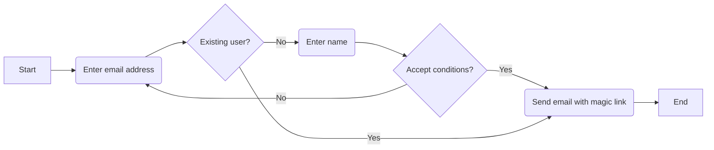
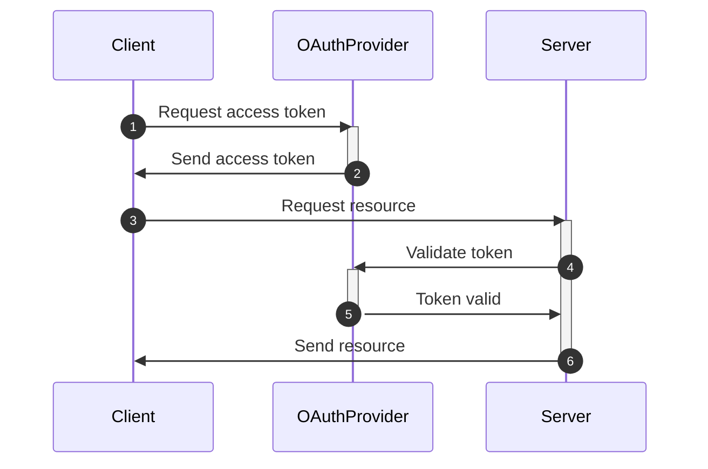
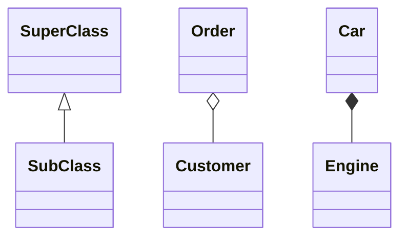
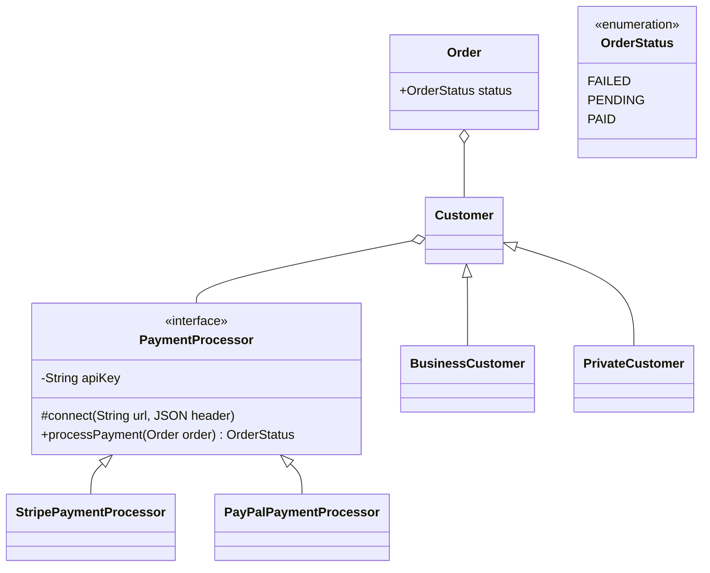
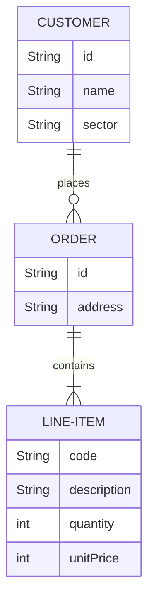

# Introduction

Generally, UML diagrams are quite useful for visualizing aspects of your code: flowcharts to describe user interactions, class diagrams to show the structure of your code, and so on. The problem is, they're a pain to draw. I really hate using these drawing tools, browsing through millions of different arrow types, having arrows that are two millimeters away from a box so they don't move when you move the box, and so on.

And for that reason, I've been using them very little. But there's a tool I found recently that I think is going to change this. It's called [Mermaid](https://mermaidjs.github.io/). Today I'm going to talk about 4 types of UML diagrams I like to use, and how they can help you illustrate your design. And then I'll show you how to draw them really quickly with Mermaid, without any of the frustrations.

If you want to learn more about how to design software from scratch, I've written a guide to help you. It's available for free at arjancodes.com/designguide. It contains the 7 steps I take that help me make better design decisions. And I think you'll find it quite helpful as well. So, go to arjancodes.com/designguide for your free copy. The link is also in the description of this video.

Now let's dive into UML.

# Flowcharts

# Sequence diagram

# Class diagrams

Most common relationships between classes: inheritance, aggregation, composition.

In mermaid:
<|-- Inheritance
\*-- Composition
o-- Aggregation

What's the difference between composition and aggregation? Aggregation and Composition are subsets of association meaning they are specific cases of association. In both aggregation and composition an object of one class maintains a reference to an object of another class. But there is a subtle difference:

- Aggregation implies a relationship where the child can exist independently of the parent. Example: an order refers to a customer. If you delete the order, the customer should still exist.
- Composition implies a relationship where the child cannot exist independent of the parent. Example: Car (parent) and Engine (child). Engines don't exist separate to a Car.

# Entity-relationship diagram

