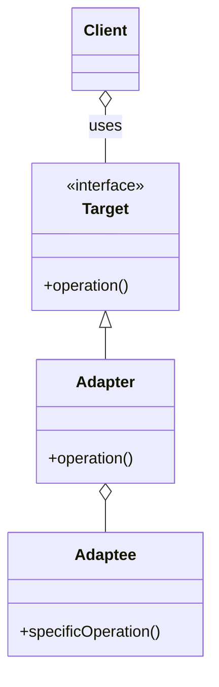

# Intro

This video covers the Adapter pattern and a few variations of it. I'll start with the classic pattern which relies on classes. But then I'll show you how to take this a step further by taking the idea of the pattern and using modern Python features to achieve the same effect, but with less code.

Knowing some of these design patterns is quite useful, as they're great tools to help you improve the design of your software. They reduce coupling and make it easier to change or extend your code. If you want to learn more about how to design a piece of software from scratch, I've written a free guide to help you. You can get the guide at arjancodes.com/designguide. It describes the 7 steps that I take when I design software. I think you'll find it helpful in structuring the way you approach software design. So, arjancodes.com/designguide, the link is also in the description of this video.

Now let's look at today's example.

# Explain the example code

This application relies on a config file written in JSON format. You'd like to allow for the possibility to read a config from an XML file as well, but you realize that existing libraries for getting data from an XML structure don't directly fit into your application. This is where the Adapter comes in.

# Goal of the Adapter pattern (Talking head couch)

The goal of the Adapter pattern is to adapt an existing system so you can use it in your application. You do this by creating a layer (that's called the Adapter) between the existing system and your application. It's a bit like when you have something that has a micro USB input used for charging, but you have a USB-C charger. The cable doesn't fit, but you can use an adapter that you put between the USB-C cable and the Micro USB input. That's what the Adapter pattern does, but then in software.

There are two versions of the classic Adapter pattern: object-based and class-based.

# Object-based version (Screencast)

In the object-based version of the pattern, the Adapter maintains an instance of Adaptee and calls operations on the instance.

# Change the example to use an object-based adapter (Screencast)

# Class-based version (Screencast)

In the class-based version of the pattern, the Adapter _inherits_ from the Adaptee and adds extra methods to conform to the interface.

# Taking the pattern to the next level (Talking head main)

The idea of the pattern is that it forms a adaptation layer between the existing system and your application. There's no particular reason to use a class for that. In fact, if you use a function that's partially applied, you can achieve the same adaptation, shorten the code at the same, and boast about being a functional programming elitist.

# Change the code to use function + partial

# Outro

I hope you enjoyed this deeper dive into the Adapter pattern and the alternatives we have Python to achieve the same thing. Give this video a like, it helps spread the word. If you want to learn more about software design and development, consider subscribing. Thanks for watching, take care, and see you soon.
