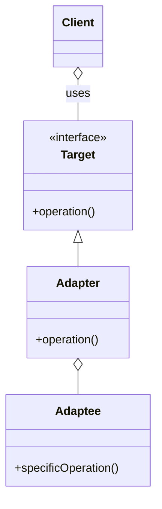

# Class diagram

There are two versions of the classic Adapter pattern: object-based and class-based.

## Object-based version

In the object-based version of the pattern, the Adapter maintains an instance of Adaptee and calls operations on the instance.

## Class-based version

In the class-based version of the pattern, the Adapter _inherits_ from the Adaptee and adds extra methods to conform to the interface

