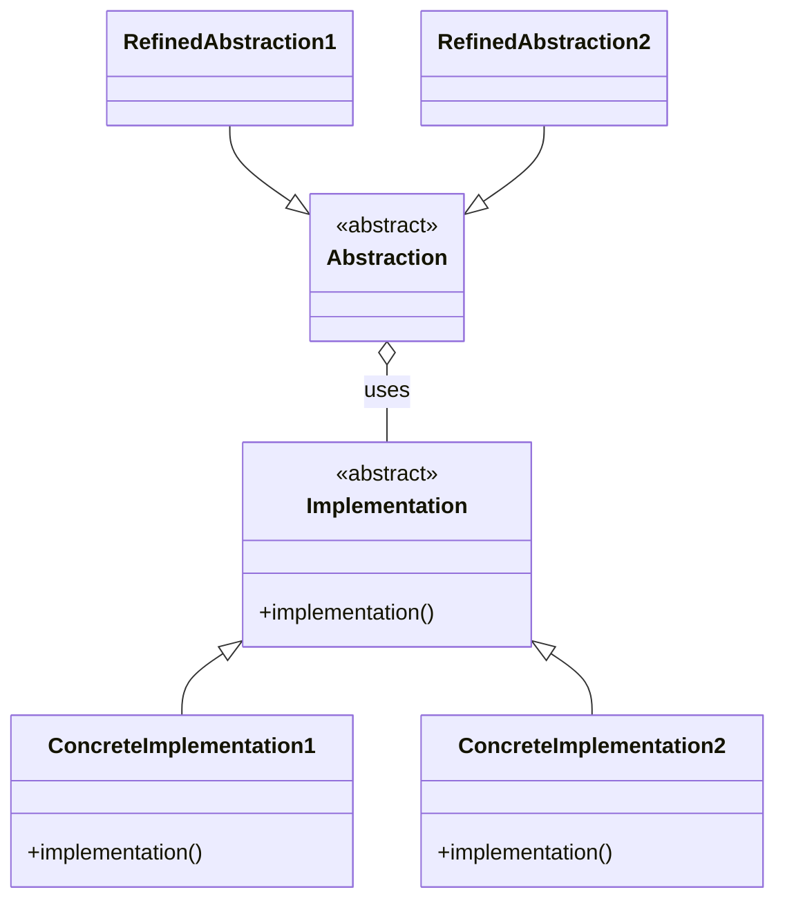
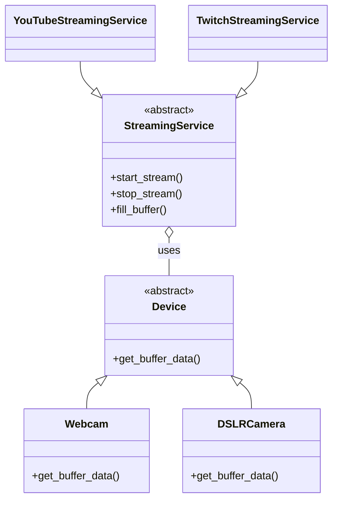

# Bridge pattern

In this video, I'm going to talk about the Bridge pattern and show you how to build it in Python. But I'm going to do things the Pythonic way.

The Bridge pattern is a design pattern that introduces two separate hierarchies of abstraction. In the Gang Of Four book, I find the way that this pattern is presented is a bit confusing. They talk about an abstraction (with refined abstractions), and an implementation (with concrete implementation subclasses). But it's not really clear why one hierarchy is an abstraction and the other an implementation. I prefer to keep things simple and just say that there are two hierarchies that depend on each other, but you can introduce new variations in each hierarchy (by adding subclasses) independently from each other.

Let's take a look at the Bridge pattern class diagram:

What makes the Bridge pattern interesting is that the coupling occurs on the abstract level: the Abstraction (which is abstract) uses the Implementation (which is also abstract). The coupling happening on this level is what lends the Bridge pattern its power.

# Bridge pattern (simple version with Protocol classes)

Updated class diagram:

# Bridge pattern (using a function)

# Bridge pattern using an ABC and device list (talking head)

The Bridge pattern is actually a good use case for not using a Protocol class, but using an ABC. The main reason is that we can use the ABC to define the relationship between the Abstraction and the Implementation in the pattern. So in this case, the relationship between the streaming service and the device. With protocols, this isn't possible because there's no inheritance relationship, only duck typing.

Let's also introduce a little variety. Wouldn't it be nice to have a list of devices instead of a single device. By using ABCs, we can define this in a single place (in the ABC) and then use that directly in any of the streaming services. Let's see what that looks like.

# Bridge pattern with device list and ABC (screencast)

I hope you enjoyed this video! Give it a like if you did, consider subscribing to my channel if you want to learn more about software development and design. Thanks for watching, take care, and see you soon!
