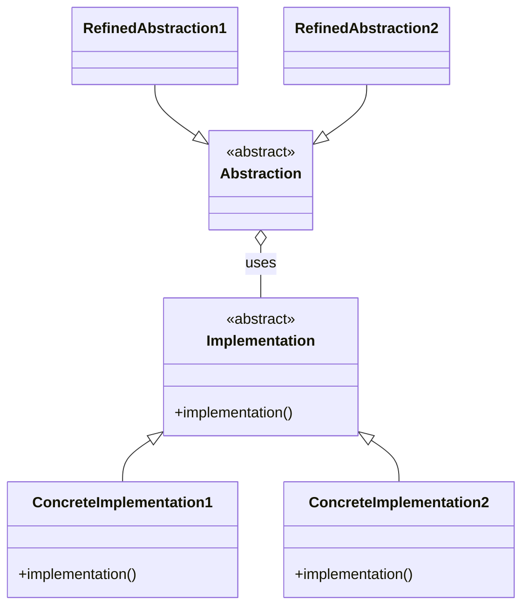
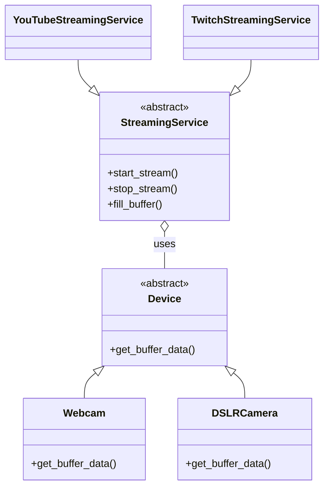

# Bridge pattern

```mermaid
classDiagram
    class Abstraction {
        <<abstract>>
    }
    RefinedAbstraction1 --|> Abstraction
    RefinedAbstraction2 --|> Abstraction
    class Implementation {
        <<abstract>>
        +implementation()
    }
    Abstraction o-- Implementation : uses
    Implementation <|-- ConcreteImplementation1
    Implementation <|-- ConcreteImplementation2
    ConcreteImplementation1: +implementation()
    ConcreteImplementation2: +implementation()
```

# Bridge pattern (adapted to example)

```mermaid
classDiagram
    class StreamingService  {
        <<abstract>>
        +start_stream()
        +stop_stream()
        +fill_buffer()
    }
    YouTubeStreamingService --|> StreamingService
    TwitchStreamingService --|> StreamingService
    class Device {
        <<abstract>>
        +get_buffer_data()
    }
    StreamingService o-- Device : uses
    Device <|-- Webcam
    Device <|-- DSLRCamera
    Webcam: +get_buffer_data()
    DSLRCamera: +get_buffer_data()
```
