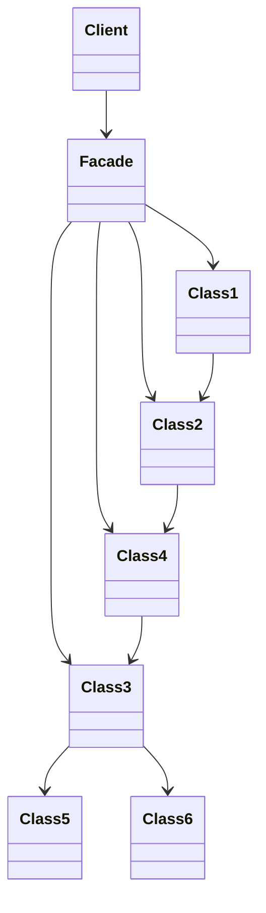

# The Facade Pattern

In this video I'm going to cover the Facade pattern.

Class diagram:

## Explain the example

I'm using an Internet-of-Things example here. In the before version, `SmartApp` needs to know a lot of details about the implementation of the system:

- that there's a service to register the devices to
- that you need to create a connection object
- that you need to construct a message object
- that you need to create a base64 representation and send that as the data over the connection object

## Controller

One thing that you can already do is split things up by using the MVC architecture. In this case, you split out the logic from the GUI (view) into a controller. In this case we can use two functions: one to power the speaker on or off, and another to retrieve the status of all the IOT devices.

Refactor and change to use controller like in `with_controller`.

This does help, but the application still needs to know implementation details of the IoT framework. The main function still needs to create a service and register devices. The controller function still needs to create a message and do all the other low-level things. If you add more functionalities to the application, like being able to send several types of messages, each of the controller functions will need to know about these low-level things.

You can create helper functions to remove duplication, but the code is still going to be coupled to the low-level IOT system.

## Facade

With the facade, this works differently. You provide a layer between the lower level classes and functions so that there's a separation between them and the higher level code. Let's build a Facade to provide a layer between the IoT system and the GUI controllers.

Create a `IOTFacade` class that will form the facade (see `with_facade` example). Adapt the controller functions to now depend on the facade instead of directly on the lower level IOT service. Use a Protocol class to introduce abstraction to decouple the controller from the facade.

Since `IOTFacade` abstracts away everything, we only need to create a `IOTFacade` object in the main file, and there's no need to know anything about the lower-level IOT system since the facade hides all of that lower-level functionality.

A few interesting things to note:

- Since I'm already using a controller, I didn't need to update the GUI class since that relies on the controller only.
- The only place where I'm still referring to lower level IOT code is in the facade class. The rest of the application is decoupled. You also see this in the main function: there's no longer a dependency there on low-level IOT code, just on the facade which is then patched together using partial to create the actual controller functions. An alternative thing you can do is to create a controller _object_ that gets a facade in its initializer. And then you can add the controller functions as methods to that class. It achieves the same thing. I slightly prefer to do it with partial since you don't need an additional object like this, and you have a bit more flexibility in that you can decide to move some of the controller functions to different files for readability, which you can't easily do with a class.
- When you want to extend the code in the future to have more functionalities, you might have to extend the facade as well to support it. This is one of the disadvantages of the facade: since it's a simplified interface to the lower-level system, it may need to be modified so that new features can be supported. However, the interaction with the lower-level system is centralized in the facade, making this a much easier job than when everything is coupled like in the original version of the code.

I hope you enjoyed this video. The Facade is really helpful in reducing coupling. Reducing coupling helps your code become a lot easier to manage. If you'd like to learn more about this, check out this video where I go through 5 tips to help you achieve this. Thanks for watching, take care, and see you next week!
