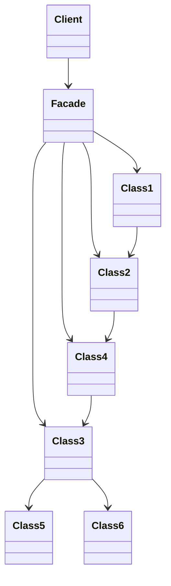

# The Facade Pattern

In this video I'm going to cover the Facade pattern.

Class diagram:

## Explain the example

I'm using an Internet-of-Things example here. In the before version, `SmartApp` needs to know a lot of details about the implementation of the system:

- that there's a service to register the devices to
- that you need to create a connection object
- that you need to construct a message object
- that you need to create a base64 representation and send that as the data over the connection object

## Controller

One thing that you can already do is split things up by using the MVC architecture. In this case, you split out the logic from the GUI (view) into a controller. In this case we can use a function.

Refactor and change to use controller like in `with_controller`.

This does help, but the application still needs to know implementation details of the IoT framework. The main function still needs to create a service and register devices. The controller function still needs to create a message and do all the other low-level things. If you add more functionalities to the application, like being able to send several types of messages, each of the controller functions will need to know about these low-level things.

## Facade

With the facade, this works differently. You provide a layer between the lower level classes and functions so that there's a separation between them and the higher level code. Let's build a Facade to provide a layer between the IoT system and the GUI.

Create a `Speaker` class that will form the facade (see `with_facade` example).

Since Speaker abstracts away everything, we only need to create a `Speaker` object in the main file, and there's no need to know anything about the lower-level IoT system.

I hope you enjoyed this video. The Facade is really helpful in reducing coupling. Reducing coupling helps your code become a lot easier to manage. If you'd like to learn more about this, check out this video where I go through 5 tips to help you achieve this. Thanks for watching, take care, and see you next week!
