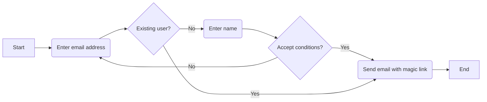
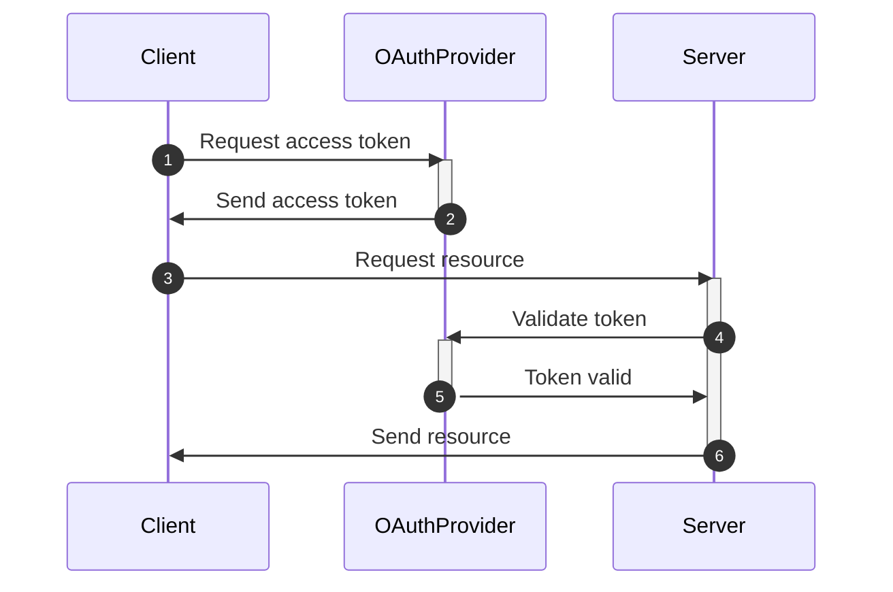
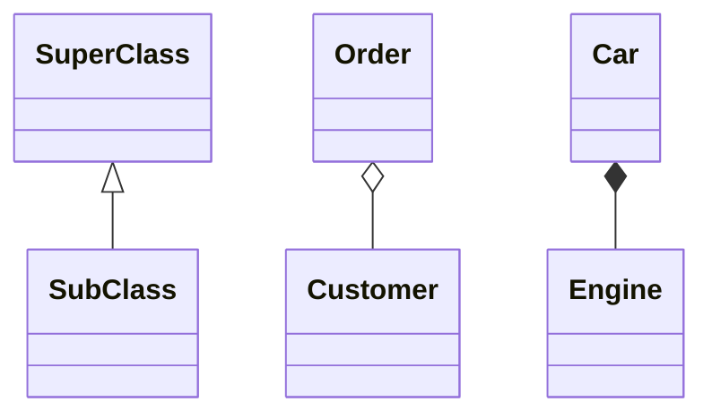
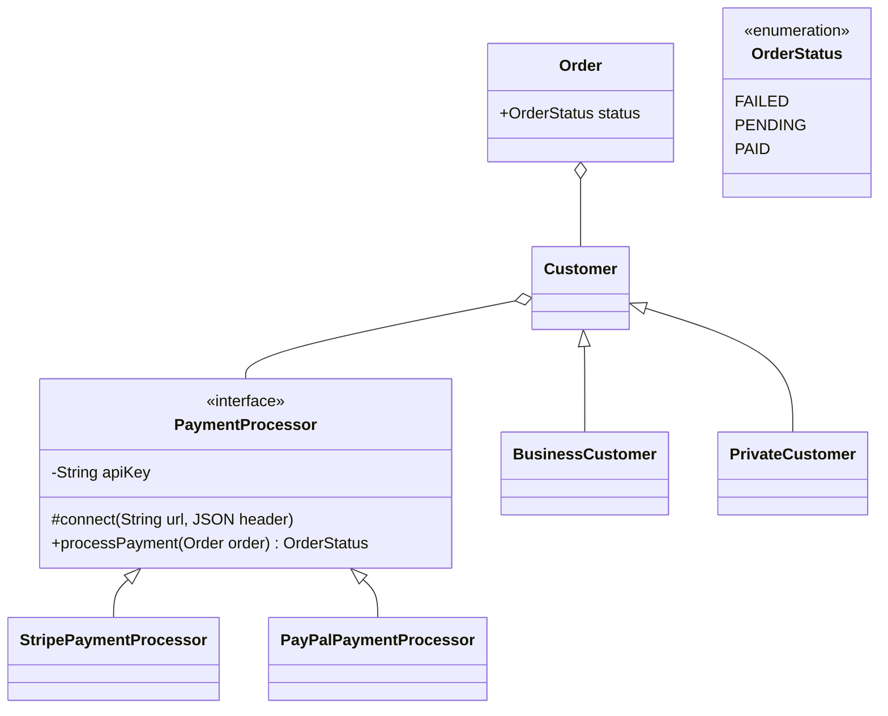
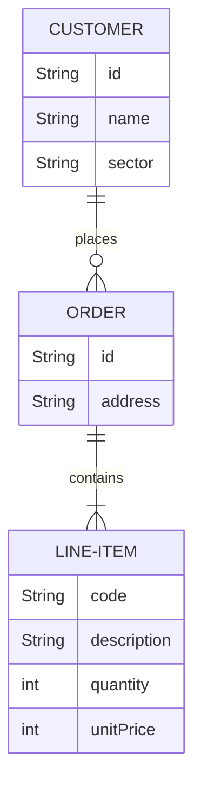

# Introduction

Generally, UML diagrams are quite useful for visualizing aspects of your code: flowcharts to describe user interactions, class diagrams to show structure of your code, and so on. The problem is, they're a pain to draw, even using tools that have specific support for them, like Draw.io.
And for that reason, I've been using them very little. But there's a tool I found recently that I think is going to change this. It's called [Mermaid](https://mermaidjs.github.io/). Today I'll show you how to use it to create UML diagrams really quickly.

Before that though, I want to talk a bit more about UML in general, whether it's really useful or not.

# Flowcharts

# Sequence diagram

# Class diagrams

Most common relationships between classes: inheritance, aggregation, composition.

In mermaid:
<|-- Inheritance
\*-- Composition
o-- Aggregation

What's the difference between composition and aggregation? Aggregation and Composition are subsets of association meaning they are specific cases of association. In both aggregation and composition an object of one class maintains a reference to an object of another class. But there is a subtle difference:

- Aggregation implies a relationship where the child can exist independently of the parent. Example: an order refers to a customer. If you delete the order, the customer should still exist.
- Composition implies a relationship where the child cannot exist independent of the parent. Example: Car (parent) and Engine (child). Engines don't exist separate to a Car.

# Entity-relationship diagram

