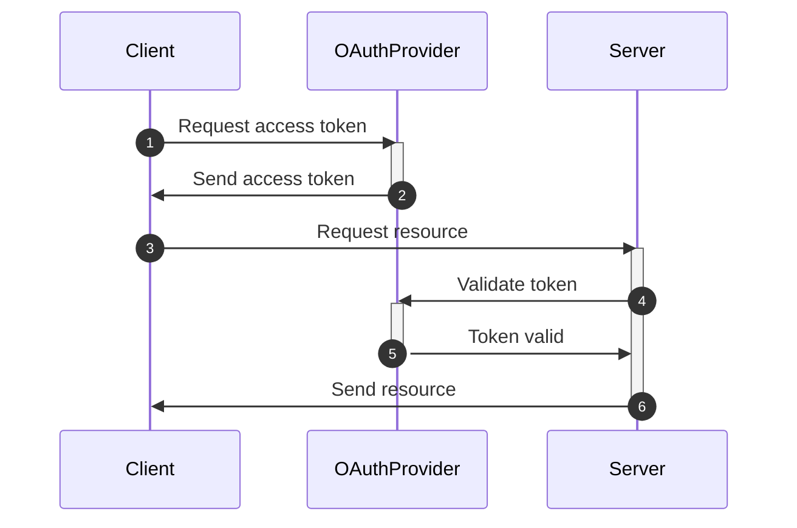
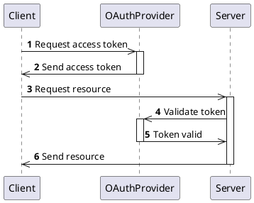

## Intro

In this video, I'm going to look at a few different ways of drawing diagrams and compare them so you can decide which one is best for you. I've talked about Mermaid before. I'll recap what you can do with Mermaid in this video, but I'll look at two other diagram drawing tools as well: PlantUML and a new kid on the block: HackerDraw.

The opinions in this video are completely mine. This is not a sponsored video, I've not been paid by any of these tools, nor did the makers of these tools see this video before I published it. I did get free access to the full version of HackerDraw for the purpose of this review.

## Mermaid

### Pros

- Really, really easy to setup. They have a live server, or install the VS Code plugin and you're good to go.
- All runs and renders locally on your machine.
- Many different sorts of diagrams, including pie charts
- Markdown integration

### Cons

- The number of settings you can change per diagram type is limited
- Syntax is not always easy to remember, especially for all the different arrow types. For example, I always have to look up the arrow syntax for entity-relationship diagrams.
- Limited control over the layout of the diagram

Here's an example of a sequence diagram in Mermaid:

## PlantUML

Sequence diagram in PlantUML

### Pros

- It's been out there for a while, so the language and tools should be pretty stable.
- It has way more capabilities and is way more flexible than either Mermaid or HackerDraw. They're not even close.
- Markdown integration

### Cons:

- Setting it up in VSCode is cumbersome: a) you need to specify the PlantUML server in two different places, b) if you want to run this locally, you need to install extra things such as Java and GraphViz.
- If running locally: you might run into version conflicts between the tools that you have installed and PlantUML
- If running on a server: you might not be happy sending your data to another server. If the Internet is offline, no UML for you.
- Not really a con, but the website is really old-fashioned (looks like it's from the 90s) + filled with ads.

## HackerDraw

Pros:

- Nice drawing tools & it's web-based. Feels a lot simpler than something like Draw,io, in a good way.
- I like the database schema tool, it's easier to use than Mermaids Entity-relationship diagrams. In Mermaid, I always have to remember all the weird arrow syntaxes.
- It's easy to embed diagrams in for example Notion, and they also offer a Confluence integration.

Cons:

- Quite limited set of diagram types
- It doesn't directly integrate with VSCode. It might be nice to have this as an extension so you don't have to go to the web interface to draw diagrams. You can actually get around this because VSCode has a built-in browser, but I find it's not always stable and there's no interaction with the rest of the interface.
- It's still a bit rough, I did find a couple of bugs while testing the tool. Most of the bugs I reported have been fixed already by the HackerDraw team though, so they're actively developing this tool.

So, what's the bottom line?

If you're looking for a good diagramming tool that's easy to get started with and that nicely integrates with VS Code and Markdown, Mermaid is a great option. Personally, that's the tool I'll keep on using as I feel it has everything I need. If you need a more extensive diagramming tool, with a lot more control, that still integrates with VS Code, and you don't mind a bit of work to set it up locally, PlantUML is the most complete tool you're going to find. If you have limited diagramming needs, but you want to integrate them in other tools like Notion or Confluence, if want to try out something new, have a really easy drawing tool available to you, give HackerDraw a spin.

I hope this comparison was helpful to you. If you enjoyed it, give this video a like and consider subscribing if you want to learn more about software development and design. Thanks for watching, take care, and see you soon.
