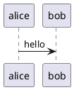

## Intro

In this video, I'm going to look at a few different ways of drawing diagrams and compare them so you can decide which one is best for you. I've talked about Mermaid before. I'll recap what you can do with Mermaid in this video, but I'll look at two other diagram drawing tools as well: PlantUML and HackerDraw.

## Mermaid

Pros

- Really, really easy to setup. They have a live server, or install the VS Code plugin and you're good to go.
- All runs and renders locally on your machine.
- Many different sorts of diagrams, including pie charts
- Markdown integration

Cons

- The number of settings you can change per diagram type is limited
- Syntax is not always easy to remember, especially for all the different arrow types. For example, I always have to look up the arrow syntax for entity-relationship diagrams.
- Limited control over the layout of the diagram

## PlantUML

Here's a basic example of creating a diagram in PlantUML:

Pros

- It's been out there for a while, so the language and tools should be pretty stable.
- It has way more capabilities and is way more flexible than either Mermaid or HackerDraw. They're not even close.
- Markdown integration

Cons:

- Setting it up in VSCode is cumbersome: a) you need to specify the PlantUML server in two different places, b) if you want to run this locally, you need to install extra things such as Java and GraphViz.
- If running locally: you might run into version conflicts between the tools that you have installed and PlantUML
- If running on a server: you might not be happy sending your data to another server. If the Internet is offline, no UML for you.
- It integrates with Markdown
- The website is really old-fashioned (looks like it's from the 90s) + filled with ads.

(not really a con, but worth mentioning: I feel Mermaid has everything I need, so even though PlantUML is much more extensive, I don't really need it)

## HackerDraw

Pros:

- Nice drawing tools & it's web-based. Feels a lot simpler than something like Draw,io, in a good way.
- I like the database schema tool, it's easier to use than Mermaids Entity-relationship diagrams. In Mermaid, I always have to remember all the weird arrow syntaxes.

Cons:

- Quite limited set of diagram types
- It's still a bit rough (see the bugs section)
- It doesn't directly integrate with VSCode. It might be nice to have this as an extension so you don't have to go to the web interface to draw diagrams. You can actually get around this because VSCode has a built-in browser, but I find it's not always stable and there's no interaction with the rest of the interface.

BUGS/SUGGESTIONS:

- I keep seeing the tutorial dialogs if I go back to the main page.
- The database schema tool is nice. It shows a grid, but I don't see a way to snap objects to the grid.
- When you export an image, it exports the entire canvas and doesn't wrap around the diagram.
- It seems if you move the boxes around, the embedded image in Notion doesn't show the changed layout.
- Also, since the embedded image in Notion shows the entire canvas, it's hard to show just the image and not a lot of empty space (especially since zooming doesn't seem to work all that well).
- Zooming in works sometimes and in different ways. For example, in the mindmap and drawing tool I'm able to zoom in, but not in the database schema.
- In the mindmap, my middle mouse behaves as a zoom control, in the drawing tool & database schema it behaves as scrolling. In the sequence diagram section, it seems to be a bit random (it does something, but not sure what).
